# AutoDMS — System Documentation
> **Architecture + Process Bible** | Last updated: 2026-05-11
> This is the source of truth for system design, workflows, and decisions.
> Keep `CLAUDE.md` (rules) and `PROJECT_STATE.md` (rolling work log) separate.

---

## Table of Contents

1. [Project Overview](#1-project-overview)
2. [Module Map](#2-module-map)
3. [Entity Relationship Map](#3-entity-relationship-map)
4. [Core Processes (Workflows)](#4-core-processes-workflows)
5. [Business Rules & Constraints](#5-business-rules--constraints)
6. [Cross-Module Interactions](#6-cross-module-interactions)
7. [Permission Matrix](#7-permission-matrix)
8. [UI Conventions](#8-ui-conventions)
9. [Data Glossary](#9-data-glossary)
10. [Decisions Log](#10-decisions-log)
11. [Open Questions](#11-open-questions)
12. [Known Gotchas & Warnings](#12-known-gotchas--warnings)
13. [Change Log](#13-change-log)
14. [Accounting Module — Design](#14-accounting-module--design)

---

## 1. Project Overview

### What the System Is

AutoDMS is a full-stack Dealership Management System built for a Pakistan-based auto dealership (Changan brand). It wraps a legacy SQL Server ERP (`temp_db1`, ~433 tables) with a modern web interface, adding workshop job-card management, procurement, inventory, finance vouchers, HR, RBAC, and a three-party finalize/unfinalize approval workflow. The legacy ERP continues to run alongside — DMS reads from its tables and writes to new `dms_*` tables without modifying legacy stored procedures.

### Tech Stack

| Layer | Technology | Notes |
|-------|-----------|-------|
| Frontend | React 18 + Vite + React Router v6 | Single-page app on `:5173` |
| HTTP client | Axios | Interceptor in `main.jsx` attaches JWT; 401 → reload |
| Icons | Lucide-React | Used exclusively throughout |
| Backend | Node.js + Express | REST API on `:5000` |
| DB driver | `mssql` (ODBC Driver 17) | Windows Auth (`Trusted_Connection=yes`) |
| Database | SQL Server `temp_db1` on `localhost` | Legacy ERP + new `dms_*` tables |
| Auth | JWT (8h expiry) + bcryptjs | Dual-path for legacy FIS hashes |
| File uploads | multer | GRN document attachments |
| Testing | Jest | `careOffUtils.js` unit tests (15 tests) |

### User Roles

| Role | How Assigned | What They Can Do |
|------|-------------|-----------------|
| **Admin** | `GroupID=1` in `GLUserGroup` | All modules; bypass creator-only finalize check; perform unfinalize (admin_unfinalize) |
| **Account Manager (AM)** | `am_approve` module permission | First-stage unfinalize approval; can see and approve/reject PENDING requests |
| **Standard User** | Per-module permissions in `dms_ModulePermissions` | Whatever modules their group has; can finalize their own records; can request unfinalize |
| **Workshop Staff** | `workshop_*` modules | Job cards, parts issue, sublet, care-off, accessories, job controller |
| **Parts / Procurement** | `procurement_*`, `parts_spare`, `sales_*` | GRN, GRTN, store sale, SSR, spare parts |

### High-Level Architecture

```
Browser (React SPA :5173)
        │  Axios + JWT Bearer
        ▼
Express API (:5000)
        │
        ├── authMiddleware (JWT verify → req.user)
        │
        ├─ /api/auth          → authController
        ├─ /api/workshop       → workshopController  ──► Addata_* / gen_JobCardType / dms_Bays
        ├─ /api/items          → itemController       ──► InventItems / gen_JobCardType
        ├─ /api/grn            → grnController        ──► data_PurchaseInfo / sp_SavePurchaseGRN
        ├─ /api/grtn           → grtnController       ──► data_PurchaseReturnInfo / sp_SavePurchaseReturn
        ├─ /api/sale           → saleController       ──► data_SaleInfo / sp_SaveStoreSale
        ├─ /api/ssr            → ssrController        ──► data_SaleReturnInfo / sp_SaveStoreSaleReturn
        ├─ /api/finalize       → finalizeController   ──► dms_UnfinalizeRequests + entity tables
        ├─ /api/care-offs      → careOffController    ──► dms_CareOff / dms_CareOffAudit
        ├─ /api/accessories    → accessoriesController──► dms_AccessoriesMaster / dms_JobCardAccessories
        ├─ /api/accounts       → accountController    ──► GLChartOFAccount / GLvMAIN / GLvDetail
        ├─ /api/permissions    → permissionController ──► GLUser / GLUserGroup / dms_ModulePermissions
        ├─ /api/employees      → employeeController   ──► gen_EmployeeInfo / vw_ActiveEmployees
        ├─ /api/parties        → partyController      ──► gen_PartiesInfo
        └─ /api/inventory-config→ inventoryConfigController ──► InventCategory / InventBrand / etc.
                │
                ▼
        SQL Server temp_db1 (Windows Auth)
        ├── Legacy ERP tables (addata_*, gen_*, data_*, GL_*, Invent_*)
        └── DMS tables (dms_*)
```

---

## 2. Module Map

### 2.1 Workshop Customers (`workshop_customers`)
- **Purpose**: Master record for vehicle owners who bring cars in for service.
- **Key entities**: `addata_CustomerInfo`, `vw_WorkshopCustomers`
- **Key files**: `pages/WorkshopCustomers.jsx`, `controllers/workshopController.js` (`getCustomers`, `saveCustomer`, `getCustomerVehicles`, `addCustomerVehicle`)
- **Depends on**: nothing
- **Used by**: Job Card (customer lookup), Birthday widget on Dashboard

### 2.2 Job Cards (`workshop_jobs`)
- **Purpose**: Core workshop document — tracks a vehicle's visit from intake to delivery.
- **Key entities**: `Addata_JobCardInfo` (header), `Addata_JobCardInfoDetail` (labour lines), `Addata_JobCardInfoSubletJobDetail` (sublet lines), `data_StockIssuetoJobCard` (parts), `dms_DamageMarks`, `dms_JobCardAccessories`
- **Key files**: `pages/JobCardList.jsx`, `pages/JobCardForm.jsx`, `controllers/workshopController.js` (`getJobCards`, `getJobCardById`, `saveJobCard`, `updateJobStatus`, `getNavigation`)
- **Depends on**: Workshop Customers, Labour & Services, Business Types (job types), RO counter, Care-Off, Accessories Master, Employees (Care-Off), Bays, Parts Issue
- **Used by**: Sublet Repairs, Parts Issue, Job Controller, Finalize, Unfinalize

### 2.3 Labour & Services (`workshop_labour`)
- **Purpose**: Catalog of standard labour operations with rates, grouped by Business Type.
- **Key entities**: `InventItems` (where `ItemType='Service'`, `JobTypeID` links to `gen_JobCardType`)
- **Key files**: `pages/LabourServices.jsx`, `controllers/itemController.js`, `routes/itemRoutes.js`
- **Depends on**: Business Types (Workshop Settings) for grouping
- **Used by**: Job Card (labour line picker), Job Controller (labour grid)

### 2.4 Sublet Repairs (`workshop_sublet`)
- **Purpose**: Outsourced repair work sent to external vendors, tracked against Job Cards.
- **Key entities**: `Addata_JobCardInfoSubletJobDetail`
- **Key files**: `pages/SubletRepair.jsx`, `controllers/workshopController.js` (`getSublets`, `saveSublet`, `deleteSublet`)
- **Depends on**: Job Cards (must link to a job card)
- **Used by**: nothing downstream

### 2.5 Parts Issue (`workshop_parts_issue`)
- **Purpose**: Issue spare parts from inventory against a Job Card.
- **Key entities**: `data_StockIssuetoJobCard`, `data_StockInOutInfo`
- **Key files**: `pages/PartsIssue.jsx`, `controllers/workshopController.js` (`getPartsIssues`, `issuePartsToJobCard`)
- **Depends on**: Job Cards, Spare Parts (InventItems)
- **Used by**: nothing downstream

### 2.6 Workshop Settings (`workshop_settings`)
- **Purpose**: Admin configuration for Business Types, Order Types, Workshop Bays, and RO/doc counters.
- **Key entities**: `gen_JobCardType`, `adgen_OrderType`, `dms_ROCounters`, `dms_DocCounters`, `dms_Bays`
- **Key files**: `pages/WorkshopSettings.jsx`, `controllers/workshopController.js` (job-types, order-types, bays, counters)
- **Depends on**: nothing
- **Used by**: Job Card (type + order type selectors, RO numbering), Job Controller (bay selector), Labour & Services (grouping)

### 2.7 Care-Off / Discount System (`workshop_careoff`)
- **Purpose**: Authorise specific employees to approve discounts on job cards, capped at a maximum %.
- **Key entities**: `dms_CareOff`, `dms_CareOffAudit`, `Addata_JobCardInfoDetail` (`Discount`, `DiscAmt`, `DiscType`)
- **Key files**: `pages/CareOffAdmin.jsx`, `controllers/careOffController.js`, `utils/careOffUtils.js`
- **Depends on**: Employees (`gen_EmployeeInfo`)
- **Used by**: Job Card (discount column, cap validation, audit)

### 2.8 Accessories Master (`workshop_accessories`)
- **Purpose**: Define the standard vehicle accessory checklist (documents, physical items).
- **Key entities**: `dms_AccessoriesMaster`, `dms_JobCardAccessories`
- **Key files**: `pages/Accessories.jsx`, `controllers/accessoriesController.js`, `routes/accessoriesRoutes.js`
- **Depends on**: nothing
- **Used by**: Job Card (Vehicle Info tab accessories checklist)

### 2.9 Job Controller (`workshop_controller`)
- **Purpose**: Real-time workshop floor view — today's jobs with status, bay assignment, and technician tracking.
- **Key entities**: `Addata_JobCardInfo` (`WorkshopStatus`), `Addata_JobCardInfoDetail` (`BayNo`, `PerformedByName`, `TechnicianId`, `JobStartTime`, `JobEndTime`), `dms_Bays`
- **Key files**: `pages/JobController.jsx`, `controllers/workshopController.js` (`getTodayJobs`, `getJobControllerDetail`, `updateWorkshopStatus`, `updateLabourAssignment`, `getBays`)
- **Depends on**: Job Cards, Bays (Workshop Settings), Employees (technicians with `IsTechnician=1`)
- **Used by**: nothing downstream

### 2.10 Spare Parts (`parts_spare`)
- **Purpose**: Inventory item master for spare parts.
- **Key entities**: `InventItems` (where `ItemType='Part'`), `InventCategory`, `InventBrand`, `InventUOM`, `InventWareHouse`
- **Key files**: `pages/Parts.jsx`, `controllers/itemController.js`
- **Depends on**: Inventory Settings (categories, brands, UOMs, warehouses)
- **Used by**: GRN, GRTN, Store Sale, SSR, Parts Issue

### 2.11 Procurement — GRN (`procurement_grn`)
- **Purpose**: Record goods received from suppliers (Goods Receipt Note).
- **Key entities**: `data_PurchaseInfo` (header), `data_PurchaseDetailInfo` (lines), `dms_DocCounters`
- **Key files**: `pages/GRN.jsx`, `controllers/grnController.js`, `routes/grnRoutes.js`
- **Depends on**: Spare Parts, Parties (suppliers), Warehouses
- **Used by**: Finalize workflow

### 2.12 Procurement — GRTN (`procurement_grtn`)
- **Purpose**: Return goods to suppliers (Goods Return Note).
- **Key entities**: `data_PurchaseReturnInfo`, `data_PurchaseReturnDetailInfo`, `dms_DocCounters`
- **Key files**: `pages/GRTN.jsx`, `controllers/grtnController.js`, `routes/grtnRoutes.js`
- **Depends on**: GRN (returns reference purchase), Spare Parts, Parties
- **Used by**: Finalize workflow

### 2.13 Store Sale (`sales_store`)
- **Purpose**: Over-the-counter spare parts sales to walk-in customers.
- **Key entities**: `data_SaleInfo`, `data_SaleDetailInfo`
- **Key files**: `pages/StoreSale.jsx`, `controllers/saleController.js`
- **Depends on**: Spare Parts, Parties
- **Used by**: nothing (finalize workflow not yet wired)

### 2.14 Sale Returns (`sales_ssr`)
- **Purpose**: Return of store-sold parts (Store Sale Return).
- **Key entities**: `data_SaleReturnInfo`, `data_SaleReturnDetailInfo`
- **Key files**: `pages/SSR.jsx`, `controllers/ssrController.js`
- **Depends on**: Store Sale
- **Used by**: nothing

### 2.15 Inventory Settings (`inventory_settings`)
- **Purpose**: Configure categories, brands, UOMs, and warehouses for parts.
- **Key entities**: `InventCategory`, `InventBrand`, `InventUOM`, `InventWareHouse`
- **Key files**: `pages/InventorySettings.jsx`, `controllers/inventoryConfigController.js`
- **Depends on**: nothing
- **Used by**: Spare Parts, GRN, GRTN, Store Sale

### 2.16 Chart of Accounts (`finance_coa`)
- **Purpose**: Manage the general ledger account tree.
- **Key entities**: `GLChartOFAccount`
- **Key files**: `pages/ChartOfAccounts.jsx`, `controllers/accountController.js` (`getCOA`, `addAccount`)
- **Depends on**: nothing
- **Used by**: Voucher Entry, GRN/GRTN GL postings

### 2.17 Vouchers (`finance_vouchers`)
- **Purpose**: Manual journal entries — CPV, CRV, BPV, BRV, JV.
- **Key entities**: `GLvMAIN` (header), `GLvDetail` (lines)
- **Key files**: `pages/VoucherEntry.jsx`, `controllers/accountController.js` (`getVoucherTypes`, `saveVoucher`)
- **Depends on**: Chart of Accounts
- **Used by**: nothing downstream in DMS

### 2.18 Credit Parties (`crm_parties`)
- **Purpose**: Manage credit customers and suppliers (parties who appear on credit job cards).
- **Key entities**: `gen_PartiesInfo`
- **Key files**: `pages/Customers.jsx`, `controllers/partyController.js`
- **Depends on**: nothing
- **Used by**: Job Card (credit/insurance jobs), GRN, GRTN, Store Sale

### 2.19 Employees (`hr_employees`)
- **Purpose**: Staff directory with technician flag for workshop floor assignment.
- **Key entities**: `gen_EmployeeInfo`, `vw_ActiveEmployees` (`IsTechnician BIT` added by DMS)
- **Key files**: `pages/Employees.jsx`, `controllers/employeeController.js`
- **Depends on**: HR Settings (departments, designations)
- **Used by**: Care-Off (employee picker), Job Controller (technician dropdown), Job Card (CheckedBy/ConfirmedBy pickers)

### 2.20 HR Settings (`hr_settings`)
- **Purpose**: Configure departments and designations.
- **Key entities**: `gen_DepartmentInfo`, `gen_DesignationInfo`
- **Key files**: `pages/HRSettings.jsx`, `controllers/departmentController.js`, `controllers/designationController.js`
- **Depends on**: nothing
- **Used by**: Employees

### 2.21 User Management (`admin_users`)
- **Purpose**: Create and manage DMS users (login credentials + role assignment).
- **Key entities**: `GLUser`, `GLUserGroup`
- **Key files**: `pages/admin/UsersAdmin.jsx`, `controllers/permissionController.js`
- **Depends on**: Roles (admin_permissions)
- **Used by**: Auth (login), RBAC (all module checks)

### 2.22 Role Permissions (`admin_permissions`)
- **Purpose**: Define which modules each role group can access.
- **Key entities**: `GLUserGroup`, `dms_ModulePermissions`
- **Key files**: `pages/admin/RolePermissions.jsx`, `controllers/permissionController.js`
- **Depends on**: nothing
- **Used by**: All protected routes (req.user.modules check)

### 2.23 Finalize (`finalize`)
- **Purpose**: Lock a record to prevent further edits (Job Card, GRN, GRTN).
- **Key entities**: `IsFinalized` bit on `Addata_JobCardInfo`, `data_PurchaseInfo`, `data_PurchaseReturnInfo`; `dms_UnfinalizeRequests`
- **Key files**: `controllers/finalizeController.js`, `routes/finalizeRoutes.js`
- **Depends on**: Any entity with `IsFinalized`
- **Used by**: Job Card, GRN, GRTN pages (Finalize button + locked state)

### 2.24 AM Approve (`am_approve`)
- **Purpose**: Account Manager stage of the unfinalize approval chain.
- **Key entities**: `dms_UnfinalizeRequests` (`Status=PENDING → AM_APPROVED`)
- **Key files**: `pages/UnfinalizeRequests.jsx`, `controllers/finalizeController.js` (`amApprove`)
- **Depends on**: Finalize (requests must exist)
- **Used by**: Admin Unfinalize

### 2.25 Admin Unfinalize (`admin_unfinalize`)
- **Purpose**: Final stage — admin performs the actual unfinalize after AM approval.
- **Key entities**: `dms_UnfinalizeRequests` (`Status=AM_APPROVED → COMPLETED`), `IsFinalized=0`
- **Key files**: `pages/UnfinalizeRequests.jsx`, `controllers/finalizeController.js` (`adminUnfinalize`)
- **Depends on**: AM Approve (must be AM_APPROVED first)
- **Used by**: nothing downstream

---

## 3. Entity Relationship Map

### Core DMS Tables

```mermaid
erDiagram
    GLUser {
        int UserID PK
        nvarchar UserName
        nvarchar UserPassword
        int GroupID FK
    }
    GLUserGroup {
        int GroupID PK
        nvarchar GroupTitle
    }
    dms_ModulePermissions {
        int GroupID FK
        nvarchar ModuleKey
    }
    GLUser }o--|| GLUserGroup : "belongs to"
    GLUserGroup ||--o{ dms_ModulePermissions : "has modules"

    addata_CustomerInfo {
        int ProfileID PK
        nvarchar endUserName
        nvarchar PhoneNo
        nvarchar RegistrationNo
        nvarchar ChasisNo
        date DOB
        int PartyID FK
    }
    gen_PartiesInfo {
        int PartyID PK
        nvarchar PartyName
    }
    addata_CustomerInfo }o--o| gen_PartiesInfo : "credit party"

    Addata_JobCardInfo {
        int JobCardId PK
        nvarchar JobCardNo
        date JobCardDate
        int JobTypeId FK
        int EndUserID FK
        int PartyID FK
        int JobStatus
        bit IsFinalized
        int CareOffID FK
        nvarchar WorkshopStatus
        int CreatedBy FK
    }
    gen_JobCardType {
        int JobCardTypeId PK
        nvarchar CardCode
        nvarchar Title
    }
    dms_CareOff {
        int CareOffID PK
        int EmployeeID FK
        decimal MaxDiscountPct
        bit IsActive
    }
    dms_ROCounters {
        nvarchar CardCode PK
        int CurrentCounter
    }

    Addata_JobCardInfo }o--|| addata_CustomerInfo : "end user"
    Addata_JobCardInfo }o--o| gen_PartiesInfo : "credit party"
    Addata_JobCardInfo }o--|| gen_JobCardType : "business type"
    Addata_JobCardInfo }o--o| dms_CareOff : "discount auth"
    gen_JobCardType ||--|| dms_ROCounters : "counter per type"

    Addata_JobCardInfoDetail {
        int DetailId PK
        int JobCardId FK
        int ItemId FK
        decimal Price
        decimal Discount
        nvarchar DiscType
        decimal DiscAmt
        int TechnicianId FK
        nvarchar BayNo
        datetime JobStartTime
        datetime JobEndTime
    }
    Addata_JobCardInfo ||--o{ Addata_JobCardInfoDetail : "labour lines"

    Addata_JobCardInfoSubletJobDetail {
        int SubletJobDetailID PK
        int JobCardId FK
        decimal InvoiceAmount
        decimal PayableAmount
        date SubletJobDate
        nvarchar Remarks
    }
    Addata_JobCardInfo ||--o{ Addata_JobCardInfoSubletJobDetail : "sublet work"

    dms_DamageMarks {
        int MarkID PK
        int JobCardID FK
        decimal XPct
        decimal YPct
        nvarchar Note
    }
    Addata_JobCardInfo ||--o{ dms_DamageMarks : "damage markers"

    dms_JobCardAccessories {
        int ID PK
        int JobCardID FK
        int AccessoryID FK
        bit IsChecked
        int Qty
    }
    dms_AccessoriesMaster {
        int AccessoryID PK
        nvarchar Title
        int SortOrder
        bit IsActive
    }
    Addata_JobCardInfo ||--o{ dms_JobCardAccessories : "accessories"
    dms_AccessoriesMaster ||--o{ dms_JobCardAccessories : "template"

    dms_UnfinalizeRequests {
        int RequestID PK
        nvarchar EntityType
        int EntityID
        nvarchar Status
        int RequestedBy FK
        int AMApprovedBy FK
        int AdminBy FK
    }

    data_PurchaseInfo {
        int PurchaseID PK
        nvarchar PurchaseVoucherNo
        bit IsFinalized
        int CreatedBy FK
    }
    data_PurchaseReturnInfo {
        int PurchaseReturnID PK
        nvarchar PurchaseReturnNo
        bit IsFinalized
        int CreatedBy FK
    }
    dms_DocCounters {
        nvarchar DocType PK
        int CurrentCounter
    }

    gen_EmployeeInfo {
        int EmployeeID PK
        nvarchar EmployeeName
        bit IsTechnician
        int DepartmentID FK
    }
    dms_CareOff }o--|| gen_EmployeeInfo : "employee"

    dms_Bays {
        int BayID PK
        nvarchar BayName
        bit IsActive
    }

    InventItems {
        int ItemId PK
        nvarchar ItenName
        varchar ItemType
        int JobTypeID FK
        int DepartmentID FK
        decimal ItemSalesPrice
    }
    InventItems }o--o| gen_JobCardType : "grouped under"
```



### Soft-Link Relationships (FK by code/string, not ID)

| From | Field | To | Notes |
|------|-------|----|-------|
| `dms_UnfinalizeRequests.EntityType` | string `'JOBCARD'/'GRN'/'GRTN'` | entity tables | Not a real FK; resolved in `finalizeController.js` entity-map |
| `gen_JobCardType.CardCode` | string `'CT'/'GR'` | `dms_ROCounters.CardCode` | Used for RO counter lookup; string equality |
| `Addata_JobCardInfoDetail.BayNo` | string | `dms_Bays.BayName` | Stored as name, not ID |

---

## 4. Core Processes (Workflows)

### 4.1 Job Card Creation

**Actor**: Any user with `workshop_jobs` module.

1. User navigates to `/workshop/jobs/new`.
2. User types in the **Job #** field (custom internal reference).
3. **RO Number** is auto-generated on save — not pre-assigned.
4. User selects **Business Type** (CT, GR, BP, WR) from dropdown.
5. User searches for customer by name/phone/reg no via `GET /api/workshop/customers?search=`.
6. Customer info populates read-only fields: Name, Phone, CNIC, Address.
7. User selects vehicle (reg no, chassis, engine).
8. User fills Job Card Info tab: PM Type, Service Advisor, Mileage, Promised Date, etc.
9. User adds **Labour Lines** from the service catalog (filtered by business type or searched).
   - If a Care-Off is selected, discount column appears; cap is validated live.
10. User optionally adds **Sublet** lines and **Parts** (via Parts Issue separately).
11. User fills **Vehicle Info** tab: VOC checkboxes, Fuel Level, Accessories checklist, Damage marks.
12. User clicks **Save**.
13. Backend (`saveJobCard`):
    a. Validates Care-Off cap (HTTP 422 if exceeded).
    b. Opens SQL transaction.
    c. **INSERT**: Atomically increments `dms_ROCounters` for the selected business type → gets next counter.
    d. Formats RO number: `{CardCode}-{counter padded to 4 digits}` (e.g. `CT-0042`).
    e. Inserts `Addata_JobCardInfo` with `CreatedBy`, `CreatedByName`, `IsFinalized=0`.
    f. Inserts all `Addata_JobCardInfoDetail` labour lines (with discount fields if care-off present).
    g. DELETEs then re-INSERTs `dms_JobCardAccessories`.
    h. DELETEs then re-INSERTs `dms_DamageMarks`.
    i. Commits transaction.
    j. Fire-and-forget: writes care-off audit entry if discount was applied.
14. Response includes new `JobCardId`.
15. Frontend navigates to edit URL `/workshop/jobs/{id}`.

### 4.2 RO Numbering

**Trigger**: Every new Job Card save (never on update).

1. Backend reads `JobTypeId` from request body.
2. Queries `gen_JobCardType` to get `CardCode` (e.g. `'BP'`).
3. Executes atomic UPDATE with OUTPUT:
   ```sql
   UPDATE dms_ROCounters
   SET CurrentCounter = CurrentCounter + 1
   OUTPUT INSERTED.CurrentCounter
   WHERE CardCode = @cardCode
   ```
   This uses a row-level lock — concurrent saves cannot get the same number.
4. Formats: `BP-0001`, `BP-0002`, etc. (zero-padded to 4 digits).
5. If no counter row exists for the code, returns HTTP 400 ("No RO counter found — check Workshop Settings").
6. Counter rows are auto-seeded when a new Business Type is created in Workshop Settings.

### 4.3 Finalize — Job Card / GRN / GRTN

**Trigger**: User with `finalize` module clicks Finalize button on a record they created.

1. User clicks **Finalize** on an open record.
2. Frontend calls `POST /api/finalize/{entity}/{id}`.
3. Backend (`finalizeController.finalize`):
   a. Looks up entity in whitelist: `JOBCARD → Addata_JobCardInfo`, `GRN → data_PurchaseInfo`, `GRTN → data_PurchaseReturnInfo`.
   b. Queries record: checks `IsFinalized` (HTTP 423 if already locked) and `CreatedBy`.
   c. Checks `CreatedBy === req.user.userId`. If not, and user doesn't have `admin_unfinalize` module → HTTP 403.
   d. Sets `IsFinalized=1`, `FinalizedBy`, `FinalizedByName`, `FinalizedAt`.
4. Frontend reloads the record → form becomes `<fieldset disabled>`, Finalize button replaced by "Request Unfinalize".

### 4.4 Unfinalize Request → AM Approval → Admin Execution

**Full three-party chain.**

1. **User** (any) clicks "Request Unfinalize" on a finalized record.
2. Modal prompts for a reason (required).
3. Frontend calls `POST /api/finalize/{entity}/{id}/request-unfinalize`.
4. Backend: checks record is finalized; checks no duplicate PENDING request exists; inserts `dms_UnfinalizeRequests` with `Status=PENDING`.

5. **Account Manager** (has `am_approve`) sees the request in `/unfinalize-requests` (PENDING section).
6. AM clicks Approve → `PUT /api/finalize/requests/{requestId}/am-approve`.
7. Backend: sets `Status=AM_APPROVED`, `AMApprovedBy`, `AMApprovedAt`.
   — OR — AM clicks Reject → `Status=REJECTED`, reason stored.

8. **Admin** (has `admin_unfinalize`) sees request in AM_APPROVED section.
9. Admin clicks Perform Unfinalize → `PUT /api/finalize/requests/{requestId}/admin-unfinalize`.
10. Backend (atomic transaction):
    a. Verifies `Status=AM_APPROVED`.
    b. Clears `IsFinalized=0`, `FinalizedBy=NULL`, `FinalizedByName=NULL`, `FinalizedAt=NULL` on the entity.
    c. Sets request `Status=COMPLETED`, `AdminBy`, `AdminAt`.
11. Record is now editable again.

### 4.5 Care-Off Setup

**Actor**: User with `workshop_careoff` module.

1. Admin navigates to Care-Off Management (`/workshop/care-off`).
2. Clicks **Add Care-Off**.
3. Selects an employee from the dropdown (only employees NOT already in `dms_CareOff` are shown).
4. Enters `MaxDiscountPct` (e.g. `15` for 15%).
5. Saves → `POST /api/care-offs` → inserts into `dms_CareOff` with `IsActive=1`.
6. Care-Off entry is now available in the Job Card form's "Care-Off / Discount Auth" dropdown.

### 4.6 Applying a Discount on a Job Card

**Actor**: Any user with `workshop_jobs`, after a Care-Off is selected.

1. User opens or creates a Job Card.
2. In the right panel, selects a **Care-Off employee** from the dropdown.
3. Labour table gains a **Discount** column (value + %/Rs toggle per line).
4. User enters discount amount per labour line.
5. **Live cap indicator** shows current total discount vs employee's maximum (green = under, red = over).
6. On Save, backend runs `validateDiscountCap(labourItems, maxPct)`:
   - If total discount > `maxPct × totalJobAmount + 0.005` → HTTP 422, save blocked.
7. If valid: discount amounts stored in `Addata_JobCardInfoDetail.Discount`, `.DiscAmt`, `.DiscType`.
8. **Swap guard**: if user changes Care-Off to an employee with a lower cap, and existing discounts exceed the new cap, save is blocked with a clear message.
9. Fire-and-forget audit entry written to `dms_CareOffAudit`.

### 4.7 Customer Creation & Edit

**Actor**: Any user with `workshop_customers`.

1. Navigate to Workshop Customers (`/workshop/customers`).
2. Fill: Name (required), Phone, CNIC, DOB (optional), Address, Email.
3. Fill vehicle fields: Registration No, Chassis No, Engine No, Brand, Model.
4. Save → `POST /api/workshop/customers` → upsert into `addata_CustomerInfo`.
5. Edit: click Edit on any existing row → same form pre-filled → `PUT`.
6. **This is the only path to create or update customer records.** Job Card form shows customer read-only — editing requires going to this page.

### 4.8 Accessories Check-In (Vehicle Intake)

**Actor**: Workshop staff during vehicle intake.

1. On Job Card → Vehicle Info tab → Accessories panel (right column).
2. List is pre-loaded from `dms_AccessoriesMaster` (sorted by `SortOrder`).
3. Staff ticks each item present (IsChecked) and enters quantity.
4. On Job Card Save: DELETE + re-INSERT into `dms_JobCardAccessories` atomically within the job card transaction.
5. On reload: accessories state restored from `dms_JobCardAccessories`.

### 4.9 Damage Marking

**Actor**: Workshop staff during vehicle intake.

1. On Job Card → Vehicle Info tab → center column shows SVG car diagram (top-down view).
2. Staff clicks on the diagram to mark damage locations.
3. Click coordinates captured as `XPct` / `YPct` (percentage of SVG element width/height).
4. Each mark appears as a red dot; staff can add a note and delete marks.
5. Saved atomically with the job card (DELETE + re-INSERT into `dms_DamageMarks`).
6. Also saveable standalone via `POST /api/workshop/job-cards/{id}/damage-marks`.

### 4.10 Parts Issue Against a Job Card

**Actor**: Any user with `workshop_parts_issue`.

1. Navigate to Parts Issue (`/parts-issue`).
2. Search and select a Job Card.
3. Add lines: select part from `InventItems`, enter quantity and rate.
4. Submit → `POST /api/workshop/parts-issue`.
5. Backend checks `IsFinalized` on the job card → HTTP 423 if locked.
6. Inserts into `data_StockIssuetoJobCard` and `data_StockInOutInfo`.

### 4.11 Sublet Addition

**Actor**: Any user with `workshop_sublet`.

1. Navigate to Sublet Repairs (`/workshop/sublet`).
2. Page loads all sublets (most recent first). Search or navigate with arrows.
3. Click **Add Sublet**.
4. Search and select a Job Card (required).
5. Enter description, invoice amount, payable amount, date.
6. Save → `POST /api/workshop/sublets`.
7. Backend checks `IsFinalized` on the job card → HTTP 423 if locked.
8. If the job card is **already finalized**, the record shows "🔒 Finalized — read only" badge; Edit/Delete buttons are hidden.

---

## 5. Business Rules & Constraints

### Job Cards
- RO number is **read-only** — auto-generated on first save, never editable.
- RO format: `{TYPE}-{NNNN}` (4-digit zero-padded, per business type, e.g. `CT-0042`).
- Each business type has its own independent counter sequence.
- A new counter row is auto-created when a new Business Type is added in Workshop Settings.
- Job Card `JobStatus` values: `0=Open, 1=In Progress, 2=Ready, 3=Invoiced, 4=Closed`.
- `WorkshopStatus` (workshop floor) is independent from `JobStatus` (billing status).
- Customer info on the Job Card is **read-only** — changes must be made in Workshop Customers.
- Only the record **creator** can finalize (HTTP 403 for others); admin bypasses this.
- Once finalized (`IsFinalized=1`): all form fields locked, parts issue blocked (HTTP 423), sublet add/edit blocked (HTTP 423).

### Discounts & Care-Off
- Discounts are only available when a **Care-Off** is selected on the job card.
- Without a Care-Off, all discount values are stripped to zero before saving (`effectiveItems` logic).
- Discount types: `%` (percentage of line price) or `Rs` (fixed rupee amount, capped at line price).
- Total discount across all labour lines must not exceed `MaxDiscountPct × total job amount`.
- Cap tolerance: `+0.005` PKR (prevents floating-point false rejections).
- Swapping Care-Off when existing discounts exceed new cap: **blocked** with explanation.
- Price of a labour line is **read-only** when a Care-Off is active — cannot be inflated to game the cap.

### Finalize / Unfinalize
- Only one PENDING unfinalize request per entity at a time — duplicates blocked.
- AM can only approve PENDING requests; Admin can only execute AM_APPROVED requests.
- Either AM or Admin can reject at their respective stage.
- Admin unfinalize is a **single atomic transaction** — entity unlock + request update or neither.
- Unfinalize completely clears the finalize metadata (FinalizedBy, FinalizedAt, etc.).

### GRN / GRTN
- Document numbers format: `GRN-NNNN`, `GRTN-NNNN` (single global sequence, not per supplier).
- Counter is atomic (same `UPDATE ... OUTPUT INSERTED` pattern as RO numbers).
- Creator-only finalize applies to GRN and GRTN as well.

### Employees / Technicians
- `IsTechnician=1` on `gen_EmployeeInfo` is required for an employee to appear in the Job Controller's "Performed By" dropdown.
- Toggle is an inline click on the wrench icon in the Employees page — no form needed.

### Sublet
- Sublet entries linked to a finalized job card are **read-only** (Edit/Delete hidden in UI; backend also blocks via HTTP 423).

### Accessories
- Accessories list on a Job Card is pre-loaded from `dms_AccessoriesMaster`.
- Sync is DELETE + re-INSERT — there is no partial update.

---

## 6. Cross-Module Interactions

### Finalize Lock — What Each Screen Does

| Screen | Behaviour when `IsFinalized=1` |
|--------|-------------------------------|
| `JobCardForm.jsx` | Entire form in `<fieldset disabled>`, Save button hidden, "Request Unfinalize" shown |
| `JobCardList.jsx` | 🔒 Lock badge shown, status dropdown disabled |
| `SubletRepair.jsx` | Edit/Delete buttons replaced by "🔒 Finalized — read only" badge |
| `PartsIssue.jsx` | `POST /api/workshop/parts-issue` returns HTTP 423, frontend shows error alert |
| `GRN.jsx` | Finalize button → "Request Unfinalize"; form locked |
| `GRTN.jsx` | Same as GRN |

### Care-Off Cap Re-Evaluation — When It Fires

| Trigger | What Happens |
|---------|-------------|
| User adds a labour line | `validateDiscountCap` called client-side; cap indicator updates live |
| User removes a labour line | Same — remaining total recalculated |
| User changes discount value on a line | Same |
| User changes Care-Off selection | `validateDiscountCap` called with new cap; if existing discounts exceed → swap blocked |
| Admin lowers `MaxDiscountPct` in Care-Off Admin | Existing saved job cards NOT affected (historical data preserved); only new saves or re-saves check new cap |
| Save button clicked | Backend runs `validateDiscountCap` authoritatively before transaction opens |

### Unfinalize Request Visibility

| Role | What They See on `/unfinalize-requests` |
|------|----------------------------------------|
| AM (`am_approve`) | PENDING section — can Approve or Reject |
| Admin (`admin_unfinalize`) | AM_APPROVED section — can Perform Unfinalize or Reject |
| Both | History section — COMPLETED and REJECTED requests |
| Neither | Page not accessible (no sidebar link) |

### Birthday Widget (Dashboard)

- Fetches `GET /api/workshop/birthdays`.
- Query finds customers in `addata_CustomerInfo` where `DOB` anniversary falls within the next 7 days.
- Handles year-wrap (Dec 28 → Jan 3) and Feb 29 correctly.
- "Today" entries highlighted in pink with 🎉 badge.

### Audit Trail

| Event | Written to | By |
|-------|-----------|-----|
| Discount applied on job card save | `dms_CareOffAudit` | `careOffController` (fire-and-forget after commit) |
| Care-Off created / updated | `dms_CareOffAudit` | `careOffController` |
| Finalize | `FinalizedBy`, `FinalizedAt` on entity | `finalizeController` |
| Unfinalize (complete) | `AdminBy`, `AdminAt` on request | `finalizeController` |

No unified audit log table exists for non-finalize events — audit is per-domain.

---

## 7. Permission Matrix

| Action | Standard User | Workshop Staff | AM (`am_approve`) | Admin (`admin_unfinalize`) | Super-Admin (GroupID=1) |
|--------|:---:|:---:|:---:|:---:|:---:|
| View Job Cards | ❌ | ✅ `workshop_jobs` | ✅ | ✅ | ✅ |
| Create / Edit Job Card | ❌ | ✅ | ✅ | ✅ | ✅ |
| Finalize own Job Card | ❌ | ✅ `finalize` | ✅ | ✅ | ✅ |
| Finalize others' Job Card | ❌ | ❌ | ❌ | ✅ bypass | ✅ |
| Request Unfinalize | ✅ (any authenticated) | ✅ | ✅ | ✅ | ✅ |
| AM-Approve Unfinalize | ❌ | ❌ | ✅ `am_approve` | ❌ | ✅ |
| Admin-Perform Unfinalize | ❌ | ❌ | ❌ | ✅ `admin_unfinalize` | ✅ |
| Add Care-Off employee | ❌ | ✅ `workshop_careoff` | ✅ | ✅ | ✅ |
| Apply discount on Job Card | ❌ | ✅ (if care-off assigned) | ✅ | ✅ | ✅ |
| Manage Workshop Customers | ❌ | ✅ `workshop_customers` | ✅ | ✅ | ✅ |
| Manage Accessories Master | ❌ | ✅ `workshop_accessories` | ✅ | ✅ | ✅ |
| View Job Controller | ❌ | ✅ `workshop_controller` | ✅ | ✅ | ✅ |
| Manage Labour & Services | ❌ | ✅ `workshop_labour` | ✅ | ✅ | ✅ |
| Manage Sublet Repairs | ❌ | ✅ `workshop_sublet` | ✅ | ✅ | ✅ |
| Issue Parts | ❌ | ✅ `workshop_parts_issue` | ✅ | ✅ | ✅ |
| Workshop Settings | ❌ | ✅ `workshop_settings` | ✅ | ✅ | ✅ |
| GRN Create / Finalize own | ❌ | ❌ | ✅ `procurement_grn` | ✅ | ✅ |
| User Management | ❌ | ❌ | ❌ | ❌ | ✅ `admin_users` |
| Role Permissions | ❌ | ❌ | ❌ | ❌ | ✅ `admin_permissions` |
| Chart of Accounts | ❌ | ❌ | ✅ `finance_coa` | ✅ | ✅ |
| Voucher Entry | ❌ | ❌ | ✅ `finance_vouchers` | ✅ | ✅ |
| Mark Technician Flag | ❌ | ❌ | ❌ | ❌ | ✅ `hr_employees` |

> ⚠️ "Workshop Staff" and "AM" are not fixed DB roles — they are illustrative. Any user with the relevant module key in their group's `dms_ModulePermissions` gains that capability.

---

## 8. UI Conventions

### Component Library
No external component library. All UI is hand-built with **inline styles** in React. Lucide-React for all icons.

### Color Tokens (de-facto, from CSS variables in index.css)

| Token | Value | Used For |
|-------|-------|---------|
| `var(--primary)` | Blue (approx `#3b82f6`) | Headings, active buttons, primary actions |
| `var(--border)` | Light grey | Card borders, dividers |
| `var(--text-muted)` | Medium grey | Subtitles, placeholders |
| `#f8fafc` | Near-white | Table header backgrounds, card section headers |
| `#fefce8` | Pale yellow | Job card info banners, sublet headers |
| `#f0fdf4` | Pale green | Success states, payable amounts |
| `#fef3c7` | Pale amber | Finalized / locked indicators |
| `#fee2e2` | Pale red | Destructive action borders |

### Spacing & Layout
- Cards use `.card` class with `padding: 20px` and `border-radius: 12px`.
- Page headers use `.card-header` flex layout (title left, action button right).
- Forms use `.form-group` (label + input stack) and `.grid-2` (two-column grid).
- Tables use `.table-wrapper` for horizontal scroll on small screens.

### Status Badges

| Status | Color | Usage |
|--------|-------|-------|
| Open | Blue pill | Job Card `JobStatus=0` |
| In Progress | Orange pill | `JobStatus=1` |
| Ready | Green pill | `JobStatus=2` |
| Invoiced | Purple pill | `JobStatus=3` |
| Closed | Grey pill | `JobStatus=4` |
| 🔒 Finalized | Amber pill | `IsFinalized=1` on any entity |
| Waiting For Service | Yellow | `WorkshopStatus` in Job Controller |
| Being Serviced | Blue | `WorkshopStatus` |
| Final Inspection | Purple | `WorkshopStatus` |
| Car Wash | Cyan | `WorkshopStatus` |
| Waiting For Delivery | Green | `WorkshopStatus` |
| Delivered | Grey | `WorkshopStatus` |

### Navigation Pattern (Job Card Form)
Toolbar at top: `⟨⟨ First | ⟨ Prev | [record N of M] | Next ⟩ | Last ⟩⟩`
- Arrows disabled (opacity 0.4) when at boundary.
- Implemented via `getNavigation` endpoint; `firstId`, `prevId`, `nextId`, `lastId` returned as NULLs at boundaries.
- Same pattern implemented in Sublet Repairs with client-side array navigation.

### Searchbar Pattern
- Debounced 300ms (GRN, GRTN, Job Card List).
- Placeholder hints: `"Search by Job No, Customer, Reg No..."`.
- 4-digit bare search (`0042`) matches `CT-0042`, `WR-0042`, etc. via `LIKE '%0042%'`.
- Minimum 2 characters for dropdowns (customer search, employee search).

### Finalized State
- `<fieldset disabled={isFinalized}>` greys out entire form sections.
- Amber "🔒 Finalized — read only" badge in navigation bar or action area.
- "Request Unfinalize" button replaces action buttons.

### Employee Picker (Dropdown Search)
- Min 2 characters to trigger.
- Uses `onMouseDown` on results + `onBlur` with 150ms `setTimeout` to prevent race condition between blur and click.
- Filters client-side from pre-loaded `allEmployees` array.

---

## 9. Data Glossary

| Term | Definition |
|------|-----------|
| **Job Card** | The primary workshop document for a vehicle visit. Tracks customer, vehicle, labour operations, parts used, sublet work, and billing. Each has a unique RO number. |
| **RO** | Repair Order. The auto-generated document number for a Job Card. Format: `{TYPE}-{NNNN}` (e.g. `CT-0042`). |
| **Business Type** | Category of repair work (e.g. Changan Touch, General Repair, Body & Paint, Warranty). Each has its own RO counter series. Configured in Workshop Settings. |
| **Order Type** | Secondary classification within a Job Card (e.g. Cash, Credit, Insurance). Configured in Workshop Settings. |
| **GRN** | Goods Receipt Note. Documents parts received from a supplier. Format: `GRN-NNNN`. |
| **GRTN** | Goods Return Note. Documents parts returned to a supplier. Format: `GRTN-NNNN`. |
| **SSR** | Store Sale Return. Customer returns of over-the-counter part sales. |
| **Care-Off** | A named discount authorisation — links an employee to a maximum discount percentage they're permitted to approve on job cards. |
| **DiscType** | Discount type on a labour line: `%` (percentage of line price) or `Rs` (fixed rupee amount). |
| **Sublet** | Repair work outsourced to an external vendor (e.g. glass replacement, body panel work). Tracked against a Job Card with invoice and payable amounts. |
| **VOC** | Vehicle On Collection — checklist confirming the customer was shown vehicle condition at intake. |
| **WAC** | Workshop Acceptance Checklist — documented results of the intake inspection. |
| **DQIR** | Delivery Quality Inspection Report number. Reference field on Job Card Vehicle Info. |
| **Damage Mark** | A click-placed point on the SVG car diagram recording pre-existing damage. Stored as `XPct`/`YPct` (percentage coordinates) + optional note. |
| **Accessory** | Vehicle accessory item on the intake checklist (e.g. spare tyre, floor mats, jack). Defined in Accessories Master, checked per Job Card. |
| **WorkshopStatus** | The physical floor status of a job (Waiting For Service → Being Serviced → Final Inspection → Car Wash → Waiting For Delivery → Delivered). Separate from billing `JobStatus`. |
| **Finalize** | Locking a record (`IsFinalized=1`) to prevent further edits. Requires creator permission. |
| **Unfinalize** | Reversing a finalize lock. Requires a 3-party approval chain: User → AM → Admin. |
| **IsFinalized** | Bit column on `Addata_JobCardInfo`, `data_PurchaseInfo`, `data_PurchaseReturnInfo`. `1` = locked. |
| **Creator** | The user who first saved a record (`CreatedBy` / `CreatedByName`). Only they can finalize (unless admin bypass). |
| **AM** | Account Manager. The first-stage approver in the unfinalize chain. Has `am_approve` module permission. |
| **IsTechnician** | Bit flag on `gen_EmployeeInfo`. Only employees with `IsTechnician=1` appear in Job Controller's "Performed By" dropdown. |
| **Bay** | Workshop floor bay where a vehicle is serviced. Managed in Workshop Settings. Assigned per labour line in Job Controller. |
| **Party** | A company or individual in `gen_PartiesInfo` used for credit/insurance job cards and as suppliers in procurement. |
| **Workshop Customer** | Vehicle owner in `addata_CustomerInfo`. Different from Party — this is the end-user/driver, not the billing party. |
| **dms_*** | Tables added by the DMS project (not legacy ERP). Prefix distinguishes new from legacy. |

---

## 10. Decisions Log

| Date | Decision | Reasoning |
|------|----------|-----------|
| 2026-05 | Dual-path password: bcrypt new / legacy plain-compare old | Existing `GLUser` rows use FIS proprietary hash; mass-resetting 100+ users not feasible |
| 2026-05 | Follow-up UPDATE after legacy SP, not SP modification | SPs may serve other systems; non-invasive approach prevents regression |
| 2026-05 | Entity-map whitelist in `finalizeController` | Prevents SQL injection via `:entity` URL param; single controller for all three entity types |
| 2026-05 | HTTP 423 (Locked) for finalized-record mutations | Semantically correct per RFC; frontend can detect and handle specifically |
| 2026-05 | `new sql.Request(transaction)` per loop iteration | mssql throws "parameter already declared" if a Request object is reused across loop iterations |
| 2026-05 | PowerShell `@'...'@` heredoc for sqlcmd with bcrypt hashes | Bash/PowerShell double-quoted strings expand `$2b` → empty string, corrupting stored hash |
| 2026-05 | No email field on login | User requirement: username + password only; simpler for workshop staff |
| 2026-05 | Inline styles only — no new CSS files | Matches existing codebase convention uniformly |
| 2026-05 | Atomic RO counter via `UPDATE ... OUTPUT INSERTED` | Row-level lock prevents duplicate RO numbers under concurrent saves |
| 2026-05 | GRN/GRTN counters flat in `dms_DocCounters` (not per-supplier) | GRN/GRTN are not business-type-specific; one global sequence per doc type is simpler |
| 2026-05 | Creator-only finalize (HTTP 403 for non-creator) | Policy: only the record creator can finalize their own work; prevents unauthorized locking |
| 2026-05 | Debounced search (300ms) instead of immediate fetch | Avoids DB query on every keystroke; 300ms is imperceptible to users |
| 2026-05 | `fetchFormData` / `fetchGRNs` split in GRN+GRTN | Avoids re-fetching parties/warehouses/items on every search keystroke |
| 2026-05 | 4-digit bare search matches all business types automatically | `%0042%` LIKE matches `WR-0042`, `BP-0042`, etc. — no special prefix handling needed |
| 2026-05 | Cap validation before transaction opens (not inside) | Avoids holding a transaction lock while querying `dms_CareOff`; returns HTTP 422 cleanly |
| 2026-05 | `effectiveItems` strips discounts when no Care-Off | Prevents stale discount values from a removed Care-Off being saved |
| 2026-05 | Audit fire-and-forget after commit | Audit failure must NOT roll back a successfully saved job card |
| 2026-05 | Floating-point tolerance `+0.005` in cap check | Prevents false "over cap" rejections caused by PKR rounding (e.g. 10.001 vs 10.000) |
| 2026-05 | Pure `careOffUtils.js` separate from controller | Allows Jest tests on cap logic without any DB mocking |
| 2026-05 | Swap-block: reject Care-Off change if discounts > new cap | Prevents silent data corruption when swapping to a lower-cap employee |
| 2026-05 | `PRINT` statements cannot be inside `ALTER VIEW` DDL | SQL Server parser rejects them — always split into separate sqlcmd calls |
| 2026-05 | `IsTechnician` as bit on `gen_EmployeeInfo` (not separate table) | Simplest representation; avoids a join; toggled inline from Employees page |
| 2026-05 | Labour services grouped by `gen_JobCardType` (not HR departments) | User-intended grouping is workshop Business Types (CT, GR, BP, WR), not HR org structure |
| 2026-05 | `JobTypeID` as new column on `InventItems` (not repurposed `DepartmentID`) | `DepartmentID` was added earlier for a different purpose; clean separation avoids confusion |
| 2026-05 | Sublet page: all records loaded at once, client-side navigation | Sublet count is low; no paging complexity needed; nav arrows + client filter is sufficient |
| 2026-05 | Sublet finalize lock: UI hides buttons + backend blocks HTTP 423 | Defence in depth — UI alone is not enough; API must also enforce the lock |
| 2026-05 | Damage marks stored as `XPct`/`YPct` percentage coordinates | Percentages survive SVG resize and any viewport width; absolute pixel coords would not |

---

## 11. Open Questions

| # | Question | Blocking? |
|---|----------|-----------|
| 1 | Store Sale and SSR finalize workflow — should they follow the same 3-party chain as GRN/GRTN? | No — store sale finalize not started |
| 2 | Dashboard charts — what KPIs are needed? (jobs per day, revenue, parts movement?) | No |
| 3 | Print/PDF export for Job Cards — what layout/paper size? | No |
| 4 | Notifications for pending unfinalize requests — in-app only, or also email/SMS? | No |
| 5 | Should `WorkshopStatus` changes in Job Controller be logged/audited? | No |
| 6 | Reporting module — what reports are required (sales, stock, workshop performance)? | No |
| 7 | Voucher listing / ledger view — is a read-only ledger sufficient or do users need edit? | No |
| 8 | DOB field on Workshop Customers is optional — should it trigger any warning if missing? | No |

---

## 12. Known Gotchas & Warnings

### Database
- **`ItenName`** in `InventItems` is a legacy typo. Do NOT rename it. All code uses this exact spelling.
- **`GLUser.UserPassword`** for legacy users is NOT bcrypt. Always detect with `startsWith('$2b')` before comparing. Never run bcrypt.compare on a non-bcrypt string.
- **Follow-up UPDATE pattern**: if `sp_InsertEmployee` (or any SP) succeeds but the follow-up UPDATE fails, the record exists without the new field value. No transaction wraps the SP call — by design.
- **`data_PurchaseInfo` / `data_PurchaseReturnInfo`**: `CreatedBy`/`CreatedByName` set via follow-up UPDATE. If the SP call succeeds but UPDATE fails, record exists without creator info.
- **`PRINT` inside `ALTER VIEW`**: SQL Server parser rejects `PRINT` statements inside `ALTER VIEW` DDL in the same batch. Always split DDL and PRINT into separate `sqlcmd` invocations.
- **Windows Auth on `temp_db1`**: no password in connection string. `Trusted_Connection=yes` required.

### Frontend
- **`JobCard.jsx`** (old, unused) still exists in `pages/`. The active file is `JobCardForm.jsx`. Do not confuse them.
- **`GRN.jsx`** previously had a `grns` state with no JSX to render it — fixed in Phase 4 rewrite. Do not revert to old version.
- **Employee picker race condition**: uses `onMouseDown` on results + `onBlur` with 150ms `setTimeout`. Without the delay, the blur fires before mousedown registers, closing the dropdown.
- **Accessories sync**: DELETE + re-INSERT every save. If `dms_AccessoriesMaster` items are added/removed after job cards exist, existing job cards will reflect only the items present at save time.
- **Care-Off swap**: changing Care-Off on a job card with discounts > new cap blocks the save. The user must manually reduce discounts before swapping.

### Auth / Routes
- **Route registration order in `server.js` is critical**: `/api/auth`, `/api/admin`, `/api/finalize` must be registered **before** `app.use('/api', authMiddleware)`. Reversing this order blocks login and finalize endpoints behind a JWT check.
- **401 interceptor** in `main.jsx` calls `window.location.reload()`. Works because `App.jsx` re-checks `user` on load and shows Login if token is absent. Side effect: any unsaved form data is lost on 401.

### SQL Server / PowerShell
- **bcrypt hashes contain `$`**: always use single-quoted PowerShell heredoc `@'...'@` for sqlcmd calls involving bcrypt. Double-quoted `@"..."@` expands `$2b` to an empty string, silently corrupting the hash.
- **`new sql.Request(transaction)` per loop iteration**: reusing a Request object across loop iterations throws "parameter already declared". Always create a fresh `new sql.Request(transaction)` inside the loop.

---

## 13. Change Log

| Date | Change | Session |
|------|--------|---------|
| 2026-05-11 | Project created (Phases 1–3): backend API, React SPA, RBAC + login | Earlier sessions |
| 2026-05-11 | Phase 4: Creator capture, finalize workflow, 3-party unfinalize chain | Earlier sessions |
| 2026-05-11 | Phase 5: RO number system, per-type counters, Job Card form redesign, searchbars | Earlier sessions |
| 2026-05-11 | Phase 6: Care-Off discount system, audit trail, cap validation, Jest tests | Earlier sessions |
| 2026-05-11 | Phase 7: Job Card navigation arrows, birthday widget, Vehicle Info tab redesign, DOB on customers, Accessories admin, Job Controller page | 2026-05-11 session |
| 2026-05-11 | Bay management CRUD added to Workshop Settings; `saveBay`/`deleteBay`/`getAllBays` endpoints | 2026-05-11 session |
| 2026-05-11 | `IsTechnician` flag on `gen_EmployeeInfo`; toggle in Employees page; Job Controller filters to technicians only | 2026-05-11 session |
| 2026-05-11 | Sublet Repairs redesigned: all-records navigation with arrows, client-side search, finalize lock (UI + backend) | 2026-05-11 session |
| 2026-05-11 | Labour & Services: `JobTypeID` column on `InventItems`, grouped display by Business Type, department picker in modal | 2026-05-11 session |
| 2026-05-11 | `SYSTEM_DOCUMENTATION.md` created; `PROJECT_STATE.md` updated to reference it | 2026-05-11 session |
| 2026-05-12 | Bank Transfer payment option: `dms_BankAccounts` table, `PaymentBankID` on Job Card, `GET /api/accounts/banks`, "Mark Bank" toggle on COA leaf accounts | 2026-05-12 session |
| 2026-05-12 | Accounting Module — design session complete. 30 decisions locked. Section 14 added with full design spec. Build session pending. | 2026-05-12 session |
| 2026-05-12 | Accounting Module build §14.22 items 1–5: migrations folder created. Migration `001_accounting_foundation.sql` applied. 8 new tables (`dms_SystemAccounts`, `dms_SystemAccountAudit`, `dms_TaxRates`, `dms_PartyAudit`, `dms_LoginAudit`, `dms_PasswordAudit`, `dms_PermissionAudit`, `dms_PartyLedger`). Voucher header gained `Status`/`ReversesVoucherID`/`SourceDocType`/`SourceDocID`/creator-poster-reverser metadata. Voucher detail gained `PartyID`/`JobCardID`. `dms_BankAccounts` gained `POSCommissionPct`/`BankChargesGLCAID`. `gen_PartiesInfo` gained `PartyType`. Balanced-entry trigger active on Status transition to Posted. 5 new voucher types seeded (SI/PV/PRV/SS/SSR). All 12 constraint tests pass. | 2026-05-12 build |
| 2026-05-12 | Accounting Module build §14.22 item 6: System Accounts admin UI. Backend `systemAccountsController.js` + routes (`GET /api/system-accounts`, `PUT /:roleKey`, `GET /:roleKey/posting-count`, `GET /:roleKey/audit`). Frontend `SystemAccounts.jsx` page with COA-leaf picker, posting-count warning on reassignment, audit history modal. Atomic upsert + audit-write in single transaction. New module key `accounting_setup` added to `config/modules.js` and seeded for GroupID=1. Exposed `resolveRole(roleKey)` helper for downstream controllers. | 2026-05-12 build |
| 2026-05-12 | COA seeded with full §14.2 hierarchy via migration `002_seed_coa_and_system_accounts.sql`. 32 active accounts: 5 root classes, 6 mid-level parents, 22 leaf accounts. All 12 system roles auto-assigned to their corresponding leaf accounts; audit rows written for each. Previous 3 test entries soft-deleted (Status=0). | 2026-05-12 build |
| 2026-05-12 | Accounting Module build §14.22 item 7: Tax Rates admin UI + default seed (migration `003_seed_default_tax_rates.sql`, GST 17% / PST 16% effective today). Backend `taxRatesController.js` (`getCurrent`, `getHistory`, `changeRate`, internal `resolveRate(taxType, asOfDate)` helper for downstream posting flows). Frontend `TaxRates.jsx` with current-rate cards, change-rate modal (supports today + future-dated effective dates), history modal. Rate change is atomic: closes old row, opens new row in one transaction. 4 integration tests pass (immediate change, future-dated preserves current resolution, future-date resolves to new rate, filtered-unique still blocks two open rates). | 2026-05-12 build |
| 2026-05-12 | Accounting Module build §14.22 item 8 sub-1: **Job Card finalize posting**. Migrations 004 + 005 add tax snapshot columns (TaxRate, TaxAmount) plus UnitLandedCost on labour/sublet/parts-detail lines. Pure `utils/jobCardJournalBuilder.js` produces the 13-line balanced voucher matching §14.6 exactly; 16 Jest unit tests cover §14.6 + payment-mode variations (POS, Cheque, Bank Transfer, Credit) + degenerate cases. New `services/jobCardPostingService.js` orchestrates load → resolve → build → insert atomically. `finalizeController.finalize` extended with `POSTING_HOOKS` registry; for JOBCARD entity, lock + post happen in a single transaction (rollback on posting failure). `saveJobCard`, `saveSublet`, and `issuePartsToJobCard` updated to snapshot tax per line at save time (§14.4 invariant). Total tests: 31/31 pass (16 new + 15 existing care-off). | 2026-05-12 build |
| 2026-05-12 | JobCardForm Bill Details panel now fetches GST/PST rates from `/api/tax-rates` and displays PST + GST + Total Payable inclusive of tax. Form-level math matches what backend posts. | 2026-05-12 build |
| 2026-05-12 | Accounting Module build §14.22 item 8 sub-2: **GRN finalize posting** (§14.7). Migration 006 adds `FreightTaxable` to `data_PurchaseInfo` and `TaxRate`/`TaxAmount`/`UnitLandedCost` to `data_PurchaseDetail`. Pure `utils/grnJournalBuilder.js` exports `buildGRNJournalLines` (3-line voucher per §14.7) + `snapshotGRNLines` (per-line tax + landed cost apportionment). 17 Jest unit tests cover §14.7 exactly + freight-non-taxable + no-discount + no-freight + unregistered supplier + degenerate cases. New `services/grnPostingService.js`; `finalizeController.POSTING_HOOKS.GRN = postGRNVoucher`. `grnController.saveGRN` extended with per-line snapshot follow-up (after the legacy SP) and `FreightTaxable` flag persistence. `GRN.jsx` form gets Freight Amount input + Freight is taxable checkbox (defaults YES per Decision #15). Total tests: 48/48 pass. | 2026-05-12 build |
| 2026-05-12 | Accounting Module build §14.22 item 8 sub-3: **GTRN finalize posting** (§14.8). Migration 007 adds `TaxRate`/`TaxAmount`/`UnitLandedCost` to `data_PurchaseReturnDetail`. Pure `utils/grtnJournalBuilder.js` exports `buildGRTNJournalLines` (3-4 line voucher per §14.8) + `snapshotGRTNLines` (looks up original GRN line's TaxRate + UnitLandedCost via existing `PurchaseDetailId` back-reference). 13 Jest unit tests cover §14.8 exactly + zero-variance + negative-variance (loss) + unregistered supplier + degenerate cases. New `services/grtnPostingService.js`; `finalizeController.POSTING_HOOKS.GRTN = postGRTNVoucher`. `grtnController.saveGRTN` extended with snapshot follow-up — JOINs on the source GRN line for original tax rate and carrying cost (Decision #16). Total tests: 61/61 pass. | 2026-05-12 build |
| 2026-05-12 | Accounting Module build §14.22 item 8 sub-4: **Store Sale finalize posting** (§14.9). Migration 008 adds finalize lifecycle + creator + `PaymentBankID` to `data_StoreSaleInfo` and `UnitLandedCost` to `data_StoreSaleDetail`. Pure `utils/storeSaleJournalBuilder.js` produces the 7-line voucher per §14.9. **Doc fix:** §14.9 stated totals "2,565" which was an arithmetic typo — correct sum is 2,735 (verified by the test). Fixed in `docs/Accounting_Module_Design.md`. 12 Jest unit tests cover §14.9 + payment-mode variations (POS, Cheque, Bank Transfer, Credit) + with-discount + empty cases. New `services/storeSalePostingService.js`; `finalizeController.ENTITY_MAP.STORE_SALE` + `POSTING_HOOKS.STORE_SALE = postStoreSaleVoucher`. `saleController.saveStoreSale` extended with creator + PaymentBankID persistence + per-line landed-cost snapshot. **Note on table naming:** design §14.5 referred to `data_SaleInfo` but the actual existing table is `data_StoreSaleInfo`; build uses the actual name. Total tests: 73/73 pass. | 2026-05-12 build |
| 2026-05-12 | Accounting Module build §14.22 item 8 sub-5: **SSR finalize posting** (§14.9 return). Migration 009 adds finalize lifecycle + `RefundMode`/`RefundBankID` to `data_StoreSaleReturnInfo` and `UnitLandedCost` to `data_StoreSaleReturnDetail`. Pure `utils/ssrJournalBuilder.js` produces the 7-line mirror-reverse voucher: Dr Revenue, Dr GST Payable, Dr Inventory, Cr COGS, transit through General Customer, Cr payment-side account. 12 Jest unit tests cover the §14.9 SSR pattern + refund-mode variations (POS / Cheque / Bank Transfer / Credit) + discount-reversal + empty cases. New `services/ssrPostingService.js`; `finalizeController.ENTITY_MAP.SSR` + `POSTING_HOOKS.SSR = postSSRVoucher`. `ssrController.saveSSR` extended with `RefundMode`/`RefundBankID` persistence + landed-cost snapshot via JOIN on original Store Sale lines (matched by ItemID). **All 5 posting flows of §14.22 item 8 now complete.** Total tests: 85/85 pass. | 2026-05-12 build |
| 2026-05-12 | Decision: model multi-branch parties (insurance companies, suppliers with regional offices) as separate rows in `gen_PartiesInfo` (Option A). Zero code change required. Trade-off — consolidated "parent group" rollup needs aggregation. Recorded in §14.20 Deferred items for a future build when business requirement crystallises (parent-party hierarchy or party-groups table). | 2026-05-12 design |
| 2026-05-12 | Accounting Module build §14.22 item 9: **Receive Payment / Make Payment screens** (§14.11). Migration 010 adds `AllocatedToVoucherID` to `data_FinanceVoucherDetail` and `dms_PartyLedger` for per-invoice allocation tracking. Pure `utils/paymentJournalBuilder.js` handles both directions ('receive' from customers, 'make' to suppliers): multiple modes per voucher, allocations across multiple invoices, overpayment routes to Customer Advance Received / Supplier Advance Paid, walk-in advance tagged by JobCardID. 15 Jest unit tests cover the §14.11 contract end-to-end (mixed-mode receipt, partial, overpayment, pre-payment, walk-in deposit, multi-invoice, Bank Transfer, validation errors). New `controllers/paymentController.js` (`getOutstanding`, `receivePayment`, `makePayment`) — uses CTEs to compute outstanding per-invoice (invoice voucher total minus sum of allocated payments). New `routes/paymentRoutes.js` mounted at `/api/payments`. New module key `payments` seeded for GroupID=1. Frontend `pages/ReceivePayment.jsx` + `pages/MakePayment.jsx` — workflow screens with party search → outstanding list → mixed-mode lines → manual or FIFO allocation → posts CRV/BRV (receive) or CPV/BPV (make) with `Status='Posted'` via the balanced-entry trigger. Total tests: 100/100 pass. | 2026-05-12 build |
| 2026-05-12 | UX fixes for Receive Payment: (a) walk-in mode now takes Business Unit dropdown + RO number, resolves via new `GET /api/workshop/job-cards/resolve-ro?cardCode=CT&number=42` endpoint; (b) Outstanding Invoices list now shows the source doc's RO/Invoice reference instead of voucher number (CT-0042 not SI-0042); (c) Walk-in mode now shows the Job Card's invoice total + paid (including at-finalize cash settlement) + outstanding via new `GET /api/payments/jobcard-balance/:jobCardId` endpoint. If the JC has an SI voucher with outstanding, walk-in payment auto-allocates to it; else it becomes an advance tagged by JobCardID. | 2026-05-12 build |
| 2026-05-12 | Accounting Module build §14.22 item 10: **POS Settlement screen** (§14.13). New `controllers/posSettlementController.js` with `getPending` (lists POS Clearing Dr lines net of any prior `AllocatedToVoucherID` settlement Cr) and `postSettlement` (atomic transaction: Dr Bank net deposit, Dr Bank Charges commission, Cr POS Clearing per source receipt with `AllocatedToVoucherID` tag). Per-bank commission and Bank Charges account are read from `dms_BankAccounts.POSCommissionPct` / `BankChargesGLCAID`. Admin can override commission or net deposit amounts on the review screen (per §14.13 "hybrid: auto-calc + manual review"). Frontend `pages/POSSettlement.jsx` — checkboxes per pending receipt, bank dropdown, live preview of gross/commission/net deposit, post button. Settlement posted as a BRV voucher. | 2026-05-12 build |

---

## 14. Accounting Module — Design

> **Design session:** 2026-05-12 — consultant-style collaborative session, 30 decisions locked.
> **Status:** Design complete. Ready for build.
> **Scope:** Workshop accounting only — Job Card, GRN, GTRN, Store Sale, SSR, manual Vouchers, Receive/Make Payment.
> **Deferred to future sessions:** Car Sales, Payroll / HR Salary, Incentive Distribution. The current design's foundation accommodates all three; they only add system accounts and new document types, not architectural change.

### 14.1 Foundational principles

| # | Principle | Why |
|---|-----------|-----|
| 1 | **Posting only on Finalize.** Save = no GL impact. | Keeps the ledger clean of provisional/draft noise. Reports always show committed reality. Matches every mature ERP. |
| 2 | **One voucher per finalize event** (Job Card, GRN, GTRN, Store Sale, SSR). All line types — sale, COGS, sublet payable, cash receipt — combined into one voucher with multiple balanced lines. | Simpler audit ("the voucher for this Job Card is X"). Simpler reversal (one voucher in, one reversal out). |
| 3 | **Journal lines are immutable once posted.** Amount values can never be edited. | Universal accounting principle. FBR compliance. Trust in the books. |
| 4 | **Unfinalize = mirror reversal voucher**, never deletion or void. Original voucher stays; reversal voucher posts on unfinalize date with debits/credits flipped, linked via `ReversesVoucherID`. | Perfect audit trail. The reversal is a real, dated, traceable event in the books. |
| 5 | **Subsidiary ledger pattern** (Option B). Per-party balances live in `gen_PartiesInfo` (and Job Card / advance ledger), rolling up to control accounts in the GL. | COA stays small (5-10 control accounts cover thousands of parties). Per-customer queries via subsidiary, not GL scan. |
| 6 | **Per-line tax snapshot at save time.** Each line stores its own `TaxRate` and `TaxAmount`. Never recalculated from current rate. | FBR audit safe. Open Job Cards aren't silently re-priced when admin changes the rate. |
| 7 | **Tax calculated on net (post-discount)** — Option A (discount before tax). | FBR-correct. Avoids over-paying tax on discounted sales. |
| 8 | **Revenue at gross, discount in its own account** (`Default Discount Given`). | Reports can show both list revenue and how much discount was applied. |
| 9 | **Finalize + unfinalize approval chain applies to ALL vouchers** (auto-posted and manual). Voucher Status: `Draft` / `Posted` / `Reversed`. | Manual JV gets the same audit and reversal discipline as auto-posted ones. No back-door changes to GL. |
| 10 | **Block unfinalize on downstream references.** GRN with consumed parts, Store Sale with SSR, Job Card with parts issued — all blocked at AM stage. | No partial cascade. Forces reverser to deal with dependents first. Clean books. |

### 14.2 Chart of Accounts structure

Pattern: **Option B — Subsidiary ledger.** Customers and suppliers live in `gen_PartiesInfo`; the GL has one control account per group. System accounts are individual COA leaf accounts.

```
1 — ASSETS
├─ 1.1 — Current Assets
│  ├─ 1.1.01 — Cash & Bank
│  │  ├─ Cash Book                              ← system role
│  │  └─ Bank Accounts (multiple, marked via `dms_BankAccounts`)
│  ├─ 1.1.02 — POS Clearing                      ← system role
│  ├─ 1.1.03 — Cheques on Hand                   ← system role
│  ├─ 1.1.04 — Inventory (Parts)
│  ├─ 1.1.05 — Receivables
│  │  ├─ Trade Debtors                          ← CONTROL account (subsidiary)
│  │  └─ General Customer                       ← system role (cash-sale catch-all)
│  ├─ 1.1.06 — Input GST                         ← system role (asset receivable from FBR)
│  └─ 1.1.07 — Supplier Advance Paid             ← system role
2 — LIABILITIES
├─ 2.1 — Current Liabilities
│  ├─ 2.1.01 — Trade Creditors                  ← CONTROL account (subsidiary)
│  ├─ 2.1.02 — GST Payable                      ← system role
│  ├─ 2.1.03 — PST Payable                      ← system role
│  └─ 2.1.04 — Customer Advance Received        ← system role
4 — REVENUE
├─ 4.1 — Workshop Revenue
│  ├─ Service Revenue (own labour)
│  ├─ Parts Sales Revenue
│  ├─ Sublet Revenue
│  └─ Purchase Return Variance                  ← system role (small income from GTRN at landed cost)
5 — EXPENSES
├─ 5.1 — Cost of Goods Sold (COGS — Parts)
├─ 5.2 — Cost of Services (Sublet Cost)
└─ 5.3 — Operating Expenses
   ├─ Default Discount Given                    ← system role (contra-revenue or expense)
   ├─ Rounding Adjustment                       ← system role
   └─ Bank Charges (regular account; per-bank designation in `dms_BankAccounts`)
```

### 14.3 System accounts — 12 designated roles

Single-account-per-role registry. Stored in new table `dms_SystemAccounts` (`RoleKey`, `GLCAID`, `AssignedBy`, `AssignedByName`, `AssignedAt`). Reassignment is "re-point only" — old postings stay where they were; new entries follow the new pointer. Confirmation warning if reassigning a role with existing postings. Every reassignment audit-logged in `dms_SystemAccountAudit`.

| # | Role Key | Type | Used For |
|---|---|---|---|
| 1 | `CASH_BOOK` | Asset | Cash receipts and cash payments |
| 2 | `GENERAL_CUSTOMER` | Asset (sub-ledger) | Walk-in cash-sale subsidiary; transits through every cash receipt voucher for audit |
| 3 | `GST_PAYABLE` | Liability | Output GST collected from customers on parts (Job Card, Store Sale) |
| 4 | `INPUT_GST` | Asset | Input GST paid to suppliers on GRN (claimable from FBR) |
| 5 | `PST_PAYABLE` | Liability | Output PST collected from customers on labour + sublet (Job Card only) |
| 6 | `POS_CLEARING` | Asset | POS card receipts pending bank settlement |
| 7 | `DEFAULT_DISCOUNT_GIVEN` | Expense / contra-revenue | Care-Off discounts applied to Job Cards / Store Sales |
| 8 | `ROUNDING_ADJUSTMENT` | Either | Tiny PKR rounding orphans (e.g., 17% of 123.45 leaves paisa) |
| 9 | `PURCHASE_RETURN_VARIANCE` | Revenue | Tiny income from GTRN at landed cost (supplier credits at list price; we keep apportioned discount/freight benefit) |
| 10 | `CUSTOMER_ADVANCE_RECEIVED` | Liability | Customer pre-payments and overpayments. Subsidiary tagged by PartyID (named) or JobCardID (walk-in deposit against a specific RO) |
| 11 | `SUPPLIER_ADVANCE_PAID` | Asset | Pre-payments to suppliers |
| 12 | `CHEQUES_ON_HAND` | Either | Single account for cheques received (incoming) and cheques issued (outgoing) before bank clearance |

**Note on reassignment:** Code never hardcodes a `GLCAID`. Lookup is always *"give me whichever account is currently the Cash Book"* via the `dms_SystemAccounts` table. To reassign, admin updates the row; future vouchers automatically use the new account.

### 14.4 Tax handling

#### Rates

- **GST 17%** (default) applies to **parts only** — Job Card parts lines, GRN purchases, Store Sale lines.
- **PST 16%** (default) applies to **labour and sublet revenue only** — Job Card labour lines, Job Card sublet revenue lines.
- Both rates configurable; admin-only setting screen.

**Storage: `dms_TaxRates` effective-dated history table.**

| Column | Notes |
|---|---|
| `TaxType` | `GST` or `PST` |
| `Rate` | Decimal (17.00, 16.00) |
| `EffectiveFrom` | Date this rate took effect |
| `EffectiveTo` | Date superseded (NULL for current) |
| `ChangedBy`, `ChangedByName`, `ChangedAt` | Audit |

A rate change closes the old row (sets `EffectiveTo`) and opens a new one. Historical lookups answer "what was GST on 2026-03-15?" — FBR-safe.

#### Per-line snapshot rule

Every Job Card / Store Sale / GRN line stores its own `TaxRate` and `TaxAmount` at save time. After save:
- The line's tax never recalculates, even if the rate changes.
- **New lines** added to an open document after a rate change use the current rate.
- **Editing** an existing line (changing price or quantity) refreshes its rate to current.
- **Finalized lines** are immutable regardless.

#### Calculation order — discount BEFORE tax (FBR-correct)

For sales (Job Card, Store Sale):
```
Net = LinePrice − Discount
Tax = Net × Rate
LineTotal = Net + Tax
```

No tax is paid on the discounted portion. Sales record at **gross**, with the discount as a separate line to the `Default Discount Given` account.

For purchases (GRN): supplier's discount is post-tax (see §14.6).

#### FBR filing (month-end)

Manual JV at month-end nets Input GST against GST Payable:
- Output GST collected: Dr GST Payable (its credit balance)
- Input GST paid: Cr Input GST (its debit balance)
- Net to pay FBR: difference → Cr Cash/Bank when paid

PST follows the same pattern (provincial filing).

### 14.5 Voucher lifecycle and types

#### Voucher Status states

| Status | Meaning |
|---|---|
| `Draft` | Voucher created. No GL impact. Mutable. Used for batch operations (POS settlement preview) and manual JV entry before commitment. |
| `Posted` | Voucher committed. **Immutable.** Counts in trial balance and all reports. |
| `Reversed` | Original voucher is paired with a mirror reversal voucher (linked via `ReversesVoucherID`). Both visible; net effect on every account is zero. Original `Status='Reversed'`, reversal voucher `Status='Posted'`. |

#### Voucher types

- **Auto-posted** (one per finalize event):
  - **Sales Voucher** (`SI-XXXX`) — Job Card finalize. Combines invoice, COGS, sublet payable, and cash/POS/cheque/bank receipt (if not credit).
  - **Purchase Voucher** (`PV-XXXX`) — GRN finalize. Inventory, Input GST, supplier payable, freight.
  - **Purchase Return Voucher** (`PRV-XXXX`) — GTRN finalize. Reverses inventory, GST, supplier payable; variance to Purchase Return Variance.
  - **Sale Voucher (Counter)** (`SS-XXXX`) — Store Sale finalize. Parts-only sale.
  - **Sale Return Voucher** (`SSR-XXXX`) — SSR finalize. Reverses parts sale.
- **Manual** (entered via Voucher Entry):
  - **CPV** (Cash Payment Voucher) — Dr expense or asset / Cr Cash Book.
  - **CRV** (Cash Receipt Voucher) — Dr Cash Book / Cr revenue or liability.
  - **BPV** (Bank Payment Voucher) — same as CPV via bank.
  - **BRV** (Bank Receipt Voucher) — same as CRV via bank.
  - **JV** (Journal Voucher) — generic; no cash leg.

#### Finalize / unfinalize chain on every voucher

The existing 3-party approval chain (User → AM → Admin) applies to **every voucher**:
- For auto-posted vouchers, unfinalizing the source document (e.g., Job Card) triggers the reversal voucher.
- For manual vouchers, the voucher itself is the entity being unfinalized; the reversal voucher posts directly.

**`finalizeController.js` entity-map whitelist (extended):**
- `JOBCARD` → `Addata_JobCardInfo`
- `GRN` → `data_PurchaseInfo`
- `GRTN` → `data_PurchaseReturnInfo`
- `STORE_SALE` → `data_SaleInfo`
- `SSR` → `data_SaleReturnInfo`
- `VOUCHER` → `data_FinanceVoucherInfo`

### 14.6 Job Card finalize — worked example

**Setup:** Walk-in customer, JC-CT-0042. Care-Off: Junaid (10% on labour). Payment: cash.

| Line | Item | Gross | Disc | Net | Tax |
|---|---|---:|---:|---:|---:|
| Parts: Oil Filter ×1 | 500 | — | 500 | GST 85 |
| Labour: Oil Change | 1,500 | 150 | 1,350 | PST 216 |
| Labour: Brake Insp | 500 | 50 | 450 | PST 72 |
| Sublet: Wheel Align (vendor cost 800) | 1,000 | — | 1,000 | PST 160 |

Customer pays cash: PKR 3,833.

**Sales Voucher (one voucher, 13 lines, balanced):**

| # | Account | Debit | Credit |
|---|---|---:|---:|
| 1 | General Customer | 3,833 | |
| 2 | Parts Sales Revenue | | 500 |
| 3 | Service Revenue (gross) | | 2,000 |
| 4 | Sublet Revenue (gross) | | 1,000 |
| 5 | Default Discount Given | 200 | |
| 6 | GST Payable | | 85 |
| 7 | PST Payable | | 448 |
| 8 | COGS — Parts | 195 | |
| 9 | Inventory — Parts | | 195 |
| 10 | Sublet Cost | 800 | |
| 11 | Trade Creditors (sublet vendor subsidiary) | | 800 |
| 12 | Cash Book | 3,833 | |
| 13 | General Customer | | 3,833 |
| | **Totals** | **8,861** | **8,861** ✅ |

**Subsidiary writes** (same atomic DB transaction):
- General Customer ledger: +3,833 Dr, then −3,833 Cr → net 0 (visible audit trail).
- Trade Creditors (sublet vendor): +800 Cr.

### 14.7 GRN finalize — worked example

**Setup:** GRN-0042 from ABC Auto Parts. 100 oil filters @ 200 + 50 brake pads @ 400. Trade discount PKR 1,000 (post-tax per supplier invoice). Freight PKR 500 (on supplier invoice, taxable per per-GRN checkbox).

Supplier invoice:
```
Parts                40,000
Freight                 500
Taxable subtotal     40,500
GST 17%               6,885
                     ──────
                     47,385
Trade discount       −1,000
                     ──────
Net Payable          46,385
```

**Landed unit cost** (after apportioning discount and freight proportional to gross):
- Oil filter: 200 − 5 (disc share) + 2.50 (freight share) = **197.50**
- Brake pad: 400 − 10 (disc share) + 5 (freight share) = **395.00**

**Purchase Voucher PV-0042:**

| # | Account | Debit | Credit |
|---|---|---:|---:|
| 1 | Inventory — Parts | 39,500 | |
| 2 | Input GST | 6,885 | |
| 3 | Trade Creditors (ABC Auto Parts) | | 46,385 |
| | **Totals** | **46,385** | **46,385** ✅ |

Discount is invisible in the voucher (netted into inventory). For management reporting "total trade discount received", the GRN header column `TradeDiscountAmount` is summed via report query — not a GL account.

### 14.8 GTRN finalize — worked example

**Setup:** Return 20 oil filters from GRN-0042. Supplier credit note: 4,000 parts + 680 GST = 4,680.

Inventory removal at landed cost: 20 × 197.50 = **3,950**. Variance: 4,680 − 3,950 − 680 = **50** (income).

**Purchase Return Voucher PRV-0042:**

| # | Account | Debit | Credit |
|---|---|---:|---:|
| 1 | Trade Creditors (ABC Auto Parts) | 4,680 | |
| 2 | Inventory — Parts | | 3,950 |
| 3 | Input GST | | 680 |
| 4 | Purchase Return Variance (income) | | 50 |
| | **Totals** | **4,680** | **4,680** ✅ |

Remaining 80 oil filters still at 197.50 each — unit cost preserved.

### 14.9 Store Sale + SSR

**Store Sale (`SS-XXXX`)** — parts-only counter sale. Same structure as Job Card but no labour/sublet/PST. GST applies on parts. Care-Off discount optional. Cash sale uses General Customer transit; credit sale uses named party subsidiary.

**SSR (`SSR-XXXX`)** — return voucher referencing original Store Sale. Reverses revenue, GST, inventory at landed cost. Refund leg via Cash Book (cash refund) or credit to party subsidiary (credit refund).

Both follow the same one-voucher-per-finalize pattern. Both subject to the unfinalize approval chain.

### 14.10 Insurance jobs — split receivable

**Pattern:** one Job Card, two payers. Trade Debtors splits into customer subsidiary + insurance company subsidiary.

**Inputs** (from new "Insurance" tab on Job Card form, visible when `CustomerType='Insurance'`):
- `InsurancePartyID` (from `gen_PartiesInfo` filtered to `PartyType='Insurance Company'`)
- `PolicyNumber`, `ClaimNumber`
- `Depreciation` (customer pays — manual entry)
- `UnderInsurance` (customer pays — manual entry)
- `Excess` (customer pays — manual entry; optional)

**Calculation:**
- `CustomerShare = Depreciation + UnderInsurance + Excess`
- `InsuranceShare = JobCardTotal − CustomerShare`

**Voucher:** standard Job Card voucher, but Trade Debtors debit splits between two subsidiaries (customer and insurance company). Revenue, tax, COGS, sublet cost all unchanged.

**Payment:**
- Customer pays his share at delivery via any mode (Cash / POS / Cheque / Bank). Standard receipt.
- Insurance company pays its share 30-90 days later via cheque or bank transfer. Standard receipt to their subsidiary.

**Partial claim approval edge case (deferred — Decision #29):** If insurance underpays, accountant posts a manual JV (Dr Customer or Dr Bad Debt / Cr Trade Debtors-Insurance). No dedicated workflow.

### 14.11 Receive Payment / Make Payment — dedicated screens

#### Workflow

Dedicated UI for receiving customer payments and making supplier payments — not raw voucher entry.

**Receive Payment flow:**
1. Pick party (customer search) — or pick "walk-in deposit against RO XXXX".
2. System shows: outstanding invoices for that party (with age) + any unallocated advance balance.
3. User enters payment lines — **multiple modes per receipt allowed** (Cash + POS + Cheque in one voucher).
4. User allocates the payment amount across one or more outstanding invoices (default FIFO, manual override).
5. **Overpayment** → excess routes to `CUSTOMER_ADVANCE_RECEIVED` subsidiary.
6. **Pre-payment with no invoice** → entire amount routes to `CUSTOMER_ADVANCE_RECEIVED` (PartyID or JobCardID tagging).
7. **Auto-offset on next invoice** — when a new Job Card / Store Sale is finalized for a party with an advance, system prompts to apply.

**Posting (example: customer pays mixed-mode):**

| Account | Debit | Credit |
|---|---|---:|---:|
| Cash Book | 5,000 | |
| Cheques on Hand | 6,600 | |
| Trade Debtors (Karachi Motors subsidiary) | | 11,600 |

Rule: **one receipt voucher per party per payment event.** Multiple modes within one voucher allowed; multiple parties = multiple vouchers.

**Make Payment flow:** symmetric. Pay suppliers, sublet vendors, insurance refunds, etc.

### 14.12 Cheque handling — `CHEQUES_ON_HAND`

Single account handles both directions.

**Incoming cheque received:**
- Dr `Cheques on Hand` / Cr Trade Debtors (or party subsidiary).
- Cheque sits in the account until presented and cleared at bank.

**Cheque clears:**
- Dr Bank (specific) / Cr `Cheques on Hand`.

**Cheque bounces:**
- Dr Trade Debtors (customer's subsidiary) / Cr `Cheques on Hand`. Customer balance restored to pre-payment.

**Outgoing cheque issued to supplier:**
- Dr Trade Creditors / Cr `Cheques on Hand` (becomes a negative/credit balance on this account while the cheque is in transit).

**Cheque presented (leaves our bank):**
- Dr `Cheques on Hand` / Cr Bank.

Account balance at any moment = net amount of cheques in transit.

### 14.13 POS Clearing settlement — hybrid auto-batch with manual review

When a Job Card or Store Sale is settled via POS card, the receipt voucher debits `POS_CLEARING` (not Bank). Bank settles 1-2 days later.

**Settlement workflow:**
1. **Auto-batch** (manual trigger button or nightly cron) generates a `Draft` settlement voucher for POS receipts older than N days.
2. Voucher uses the **per-bank commission rate** configured on `dms_BankAccounts.POSCommissionPct` and posts the commission expense to the per-bank `BankChargesGLCAID`.
3. **Admin reviews** the draft on a dedicated POS Settlement screen:
   - Sees all POS transactions being settled
   - Compares to actual bank statement
   - Can edit the draft (change commission, exclude rejected transactions, adjust deposit)
4. Admin clicks "Post" → draft becomes `Posted`. Immutable thereafter.

**Example settlement voucher** (POS receipts of 40,000, bank deposits 39,300 net of 1.75% commission):

| Account | Debit | Credit |
|---|---|---:|---:|
| Bank (specific) | 39,300 | |
| Bank Charges (per-bank designated expense account) | 700 | |
| POS Clearing | | 40,000 |

### 14.14 Advance payments

`CUSTOMER_ADVANCE_RECEIVED` (liability) for customer advances. `SUPPLIER_ADVANCE_PAID` (asset) for prepayments to suppliers.

**Subsidiary tagging:**
- **Named credit customer** advance: subsidiary entry uses `PartyID`. Shows on their customer statement.
- **Walk-in deposit against a specific RO**: subsidiary entry uses `JobCardID` instead of PartyID. Auto-found and applied when that specific Job Card is finalized.
- **Generic walk-in advance with no specific RO**: rare — uses General Customer subsidiary plus a memo field. Applied manually.

Same `CUSTOMER_ADVANCE_RECEIVED` GL account in all three cases — only subsidiary tagging differs.

**Auto-offset:** when a Job Card / Store Sale is finalized for a party that has an outstanding advance balance, the Receive Payment screen (and the finalize itself, optionally) prompts to apply.

### 14.15 Invoice display — tax-exclusive only

Every printed invoice (Job Card, Store Sale, etc.) shows:
- Line items at their net (post-discount) prices
- GST and PST as **separate visible lines**
- Final total

Tax-inclusive ("rates include tax") display **not supported.** Matches FBR preference and is unambiguous for corporate / insurance customers.

### 14.16 Reports — 26 reports for workshop scope

#### A. Financial reports
1. **Trial Balance** — all GL accounts with balances at a point in time.
2. **General Ledger Detail** — all transactions in any chosen account for a period (drill-down from TB).
3. **Profit & Loss** — Revenue − Discount − COGS − Sublet Cost − Expenses = Net Profit.
4. **Balance Sheet** — Assets / Liabilities / Equity at a point in time.
5. **Day Book / Day Journal** — all vouchers posted on a given day.

#### B. Subsidiary / party reports
6. **Customer Statement** — for any customer, all invoices/payments and running balance.
7. **Supplier Statement** — same for any supplier.
8. **Receivables Aging** — outstanding customer balances by age bucket (current / 1-30 / 31-60 / 61-90 / 90+).
9. **Payables Aging** — same for suppliers.

#### C. Tax / FBR compliance
10. **GST Output Summary** — collected GST for a period.
11. **GST Input Summary** — paid Input GST for a period.
12. **PST Output Summary** — collected PST for a period.
13. **Tax Rate Change History** — when rates changed, by whom.

#### D. Cash / operational
14. **Daily Cash Book** — cash in/out for a day (reconcile till).
15. **POS Settlement Pending** — POS Clearing balance with transaction detail.
16. **Cheques on Hand** — cheques in transit, by status (incoming/outgoing/cleared/bounced).
17. **Bank Balance Summary** — balance per bank account.

#### E. Workshop-specific
18. **Discount Given Report** — by Care-Off authoriser, for a period.
19. **Sales Register** — all invoiced Job Cards, GRN, GRTN, Store Sale for a period.
20. **Insurance Claims Aging** — insurance-side outstanding balances by age.
21. **Gross Margin Report** — by Job Card or period (Revenue − Discount − COGS − Sublet Cost).
22. **Inventory Valuation** — current stock at landed cost per item.
23. **General Customer Daily Reconciliation** — transit lines for a day; should sum to zero at close-of-day.

#### F. Audit / system
24. **Voucher Audit Trail** — all vouchers in a period (posted, drafts, reversed).
25. **System Account Reassignment Log** — every role re-pointing.
26. **Care-Off Audit** — already exists per Phase 6.

### 14.17 Audit log — all three tiers covered

Pattern: **specific, focused audit tables per event type.** No generic god log.

#### Tier 1 — Compliance-mandatory
- **Voucher posting/reversal**: intrinsic on voucher header (`CreatedBy`, `CreatedAt`, `PostedAt`, `ReversesVoucherID`, `ReversedBy`).
- **Finalize/unfinalize**: intrinsic on document + `dms_UnfinalizeRequests`.
- **Tax rate changes**: `dms_TaxRates` effective-dated history.
- **System account reassignment**: `dms_SystemAccountAudit` table.

#### Tier 2 — Operational
- **Party master data changes**: `dms_PartyAudit` (before/after values).
- **Bank designation toggles**: enhanced `dms_BankAccounts` history.
- **Care-Off operations**: `dms_CareOffAudit` (already exists).

#### Tier 3 — Security
- **User login/logout**: `dms_LoginAudit`.
- **Password changes/resets**: `dms_PasswordAudit`.
- **Role/permission changes**: `dms_PermissionAudit`.

### 14.18 Edge cases — resolved and deferred

| # | Edge case | Resolution |
|---|---|---|
| 1 | Insurance partial approval (claim underpaid) | **No dedicated UI.** Accountant posts manual JV (Dr Customer or Dr Bad Debt / Cr Trade Debtors-Insurance). Decision #29. |
| 2 | Unfinalize document with downstream references | **Block at AM stage.** Error message lists dependents. No partial unfinalize. Decision #30. |
| 3 | Mid-edit rate change | Per-line snapshot rule (§14.4) covers this automatically. |
| 4 | Cheque bounce | Reversal voucher via Cheques on Hand pattern (§14.12). |
| 5 | POS bank settlement variance | Draft-edit-post pattern (§14.13) catches it. |

### 14.19 Decisions log — all 30 lock-ins

| # | Decision | Rationale (where non-obvious) |
|---|---|---|
| 1 | COA structure: Option B (subsidiary ledger) | Party count will grow; COA must stay small. |
| 2 | Freight on GRN: capitalize into inventory cost; credited to supplier | IAS 2 compliant; honest margin reports. |
| 3 | System accounts list — 12 (for workshop scope) | Will grow with car sales / payroll / incentives in future sessions. |
| 4 | System role reassignment: re-point only | Simplest, no magic journal entries; consolidate via explicit manual JV if needed. |
| 5 | Tax rates: effective-dated history | FBR audit safety; historical rate lookups always answerable. |
| 6 | Tax on each line: snapshot at save time | Saved Job Cards not silently re-priced when rate changes. |
| 7 | Job Card tax calc: discount BEFORE tax | FBR-correct; no overpaying tax on discounted sales. |
| 8 | GRN: supplier discount post-tax; full GST input claimed | Matches what supplier reported to FBR; trade discount reduces inventory only. |
| 9 | PST on labour + sublet (both); no Input PST | Sublet vendors typically unregistered. Customer-side PST applies to all services rendered. |
| 10 | Posting trigger: on Finalize only | Ledger always reflects committed reality; reports trustworthy. |
| 11 | Unfinalize: mirror reversal JV | Audit trail intact; FBR-safe; standard practice. |
| 12 | Voucher granularity: one big voucher per Job Card finalize | Same reporting power as multi-voucher (account-level aggregation); simpler reversal. |
| 13 | Cash/POS/Bank/Cheque at finalize: combined voucher with General Customer transit | Daily cash reconciliation visible; consistency across payment modes. |
| 14 | Revenue at GROSS, discount in its own account | Lets reports show list revenue and discount cost separately. |
| 15 | Freight taxability on GRN: per-GRN checkbox (default YES) | Matches what supplier's invoice actually shows; FBR-safe per-supplier handling. |
| 16 | GTRN inventory at LANDED cost; variance to Purchase Return Variance | Preserves unit cost; captures small benefit cleanly. |
| 17 | Receive Payment / Make Payment: dedicated workflow screens | Front desk staff aren't accountants; manual voucher entry breeds errors. |
| 18 | Advance payments supported; subsidiary tagging by PartyID OR JobCardID | Walk-in deposits trackable without inventing a separate account. |
| 19 | Cheques: single "Cheques on Hand" account both directions | Net balance = cheques in transit; simpler than two accounts. |
| 20 | Insurance jobs: one Job Card with split receivable | One physical job; receivable splits to two subsidiaries. |
| 21 | Mixed payment modes in one receipt voucher; one voucher per party per event | Matches real-world payment habits; clean audit. |
| 22 | POS settlement: hybrid (auto-batch Draft + admin review + post) | Catches bank variance manually while reducing routine work. |
| 23 | Invoice display: tax-exclusive (separate GST/PST lines) | FBR-preferred; unambiguous for corporate/insurance customers. |
| 24 | Session scope: workshop accounting only; Car Sales / Payroll / Incentives deferred | Avoids decision fatigue; focused depth per domain. |
| 25 | Store Sale finalize: same pattern as Job Card, parts-only | Reuses Job Card voucher structure minus labour/sublet/PST. |
| 26 | SSR finalize: return voucher referencing original Store Sale | Block fraud; mirror cost basis; consistent with GTRN pattern. |
| 27 | Audit log: all three tiers; specific audit tables per event | Domain-specific tables are queryable; god table is JSON hell. |
| 28 | Finalize concept applies to ALL vouchers (auto + manual). Status: Draft/Posted/Reversed | Manual JV gets same audit discipline; no back-door GL changes. |
| 29 | Insurance partial approval: manual JV, no dedicated UI | Rare; accountant can handle via voucher entry. |
| 30 | Unfinalize blocked when downstream references exist | Forces clean cascade; no partial reversal complexity. |

### 14.20 Deferred items (for future sessions)

| Topic | Owner of next session | Notes |
|---|---|---|
| Car Sales accounting | Future design session | Vehicle inventory per-VIN; pay-orders; withholding tax; vehicle sales tax; parent company subsidiary; trade-ins. Likely 5-8 new system accounts. |
| Incentive Distribution | Future design session | Department-wise (service) and individual (car sales) bonuses; accrual vs cash basis; 2-3 new system accounts. |
| Payroll / HR Salary | Future design session | Monthly salary, EOBI, income tax withholding, advances, fines, loans; 5-8 new system accounts. |
| Build session for workshop accounting | Build session | Implement everything in §14.1 – §14.18. |
| **Multi-branch party consolidation reporting** | Future build session | Insurance companies (EFU, Adamjee, etc.) and large suppliers often operate from multiple regional branches that act independently — separate adjusters, separate cheques, separate timing. Decided 2026-05-12 to model each branch as a separate row in `gen_PartiesInfo` (Option A — zero schema change, mirrors operational reality). Trade-off accepted: "total EFU group" requires aggregation across branches. Future enhancement: add either (a) `ParentPartyID INT NULL` self-FK on `gen_PartiesInfo` for parent-child hierarchy, or (b) a `dms_PartyGroups` table linking related parties into named groups. Reports (Customer Statement, Supplier Statement, Aging) would then offer an optional "rollup by parent/group" mode. Trigger: customer asks for a consolidated parent-company statement OR there are too many same-prefix parties to navigate by name. Estimated effort: 1 migration + 1 join in reports + 1 optional dropdown in UI. |

### 14.21 What this design does NOT cover

- **Vehicle sales** — see Section 14.20.
- **Payroll** — see Section 14.20.
- **Incentive accruals** — see Section 14.20.
- **Stock-take adjustments** — needed eventually; not in this session.
- **Inter-branch transfers** — if you ever open a second branch.
- **Multi-company / multi-fiscal-year** — schema supports; UI not.
- **IFRS Cash Flow Statement** — not common for workshops; deferrable.

### 14.22 Build session checklist (next step)

When the build session starts:
1. Create new DB tables: `dms_SystemAccounts`, `dms_SystemAccountAudit`, `dms_TaxRates`, `dms_PartyAudit`, `dms_LoginAudit`, `dms_PasswordAudit`, `dms_PermissionAudit`.
2. Extend `data_FinanceVoucherInfo` with: `Status` (Draft/Posted/Reversed), `ReversesVoucherID`, `SourceDocType`, `SourceDocID`.
3. Extend `data_FinanceVoucherDetail` with: `PartyID` (nullable, for subsidiary tagging), `JobCardID` (nullable, for advance tagging).
4. Extend `dms_BankAccounts` with: `POSCommissionPct`, `BankChargesGLCAID`.
5. Build `gen_PartyLedger` subsidiary table (or use existing audit pattern) for per-party balances.
6. Seed initial system accounts via admin UI (12 roles).
7. Seed default tax rates (GST 17%, PST 16%).
8. Build the 5 worked-example posting flows: Job Card, GRN, GTRN, Store Sale, SSR.
9. Build Receive Payment / Make Payment screens.
10. Build POS Settlement screen.
11. Build the 26 reports (prioritize: Trial Balance, GL Detail, Customer/Supplier Statement, Daily Cash Book, GST/PST Summary first).
12. Add finalize/unfinalize to manual vouchers (extend entity-map).
13. Add unfinalize cascade-block rule for documents with downstream references.
